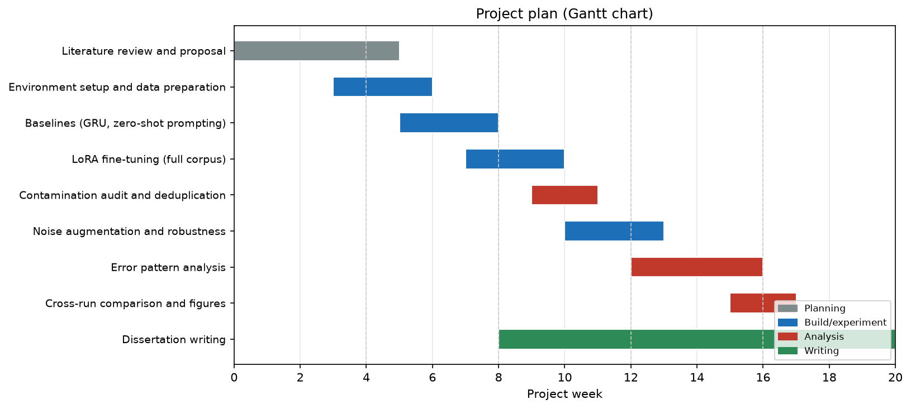

# Chapter 1. Project Management

This chapter describes how the project was planned and run: its methodology and working practices, the resources used, the execution against the plan, the timeline, the risks and how they were managed, and a reflection on what was learned.

## 1.1 Project methodology and approach

The project was empirical research and was run as an iterative, experiment-driven cycle. Each cycle produced a result, the result was analysed, and the analysis decided the next experiment. The direction of the work changed at several points as the evidence accumulated, as the execution and reflection sections below describe.

Three practices supported this. First, all code, configuration, and results were kept under version control with Git, so every experiment could be traced to the exact code that produced it and reproduced later. Second, a fixed random seed and recorded generation settings allowed a run to be repeated exactly, so that a difference between two runs could be attributed to a real change in the setup. Third, regular supervision meetings reviewed progress and agreed next steps, and a project workbook recorded ideas, references, problems, and decisions as the work progressed.

The project also aligned with a shared error analysis framework used within the research group and ran alongside a parallel study by a peer that applied prompting to the same task. The two studies could therefore be compared directly, one using prompting and this one using fine-tuning, and the error analysis in both followed an agreed structure.

## 1.2 Project resources

The main hardware constraint was the graphics card. Training and inference used a university GPU workstation with limited memory, which ruled out full fine-tuning of a multi-billion-parameter model at full precision. This shaped the central design choice, QLoRA, which quantises the model to four-bit precision and trains only small adapter matrices, keeping the whole process within the available memory. A separate CPU environment was used to develop and test the pipeline before committing GPU time to long runs.

The software stack was Python with the PyTorch deep-learning framework and the Hugging Face Transformers library for the model, the PEFT library for LoRA adaptation, and bitsandbytes for four-bit quantisation. Evaluation used jiwer for word and character error rates, sacrebleu for BLEU, the NLTK CMU Pronouncing Dictionary for phoneme and homophone lookups, spaCy for the grammar analysis, and BERTScore and Sentence-BERT for semantic scoring. Figures were produced with Matplotlib. The model was Llama-3.2-3B, obtained through gated access on Hugging Face, and the data was the LRS2 phoneme and text transcriptions.

## 1.3 Project execution

The work was carried out in phases: review and proposal, environment and data preparation, baselines, fine-tuning, leakage-controlled evaluation, robustness, error analysis, and a writing phase that ran alongside the later technical work. The Gantt chart in the next section shows these phases and their overlaps.

The plan changed at three turning points, and each followed the same pattern: a result was analysed, and the analysis decided the next step.

The first turning point was the choice of method. The project was framed at the outset around specialised handling of homophones, on the assumption that they were the main source of error. Early evidence, supported by the parallel study, showed homophones to be a small share of the mistakes, so the work was redirected toward accuracy, leakage-free evaluation, and robustness, and the homophone assumption was carried forward as a hypothesis to test directly in the error analysis (Chapter 10).

The second turning point came from the evaluation itself. A high headline accuracy on the standard split prompted a closer look, which found that a share of the evaluation sentences appeared verbatim in the training data. A contamination audit was added, and a deduplicated evaluation set became the reported measure (Chapters 7 and 9), so the headline figure reflected genuine generalisation.

The third turning point concerned the decoding strategy. Two runs that were expected to be equivalent differed by several points, which first looked like training instability. Comparing them showed that the generation strategy had changed between the runs, greedy in one and beam search in the other. Decoding was then treated as an explicit experimental variable, recorded and held fixed for every comparison (Chapters 5 and 9).

## 1.4 Gantt chart

The project timeline is shown in Figure 1.1, with tasks grouped into planning, build and experiment, analysis, and writing phases; writing ran in parallel with the later technical work so chapters were drafted while the experiments were fresh. A full-size version is in Appendix A. The week numbers are relative to the start of the project, and the calendar dates should be read against the student's own schedule.

## 1.5 Risk management

Risks were identified at the start and reviewed during supervision meetings. Table 1.1 lists the main risks, their likelihood and impact before mitigation, and the action taken. The most consequential were the limited GPU memory, mitigated by QLoRA, and the risk that reported accuracy would be inflated by data overlap, mitigated by the contamination audit and deduplicated reporting.

| Risk | Likelihood | Impact | Mitigation |
| --- | --- | --- | --- |
| Limited GPU memory prevents training the model | High | High | Use QLoRA (four-bit quantisation, small adapters) to fit the model on the available card; develop the pipeline on CPU first |
| Gated access to the pretrained model is delayed | Medium | High | Request access early; keep an open, tokenizer-identical mirror as a fallback for development |
| Reported accuracy inflated by train-evaluation overlap | High | High | Audit the corpus for overlap and report a deduplicated figure as the headline result |
| Results not reproducible across runs | Medium | Medium | Fix the random seed, record generation settings, and keep all runs under version control |
| A long training run fails partway | Medium | Medium | Save a checkpoint after each epoch so a failed run can resume rather than restart |
| Scope grows beyond the available time | Medium | Medium | Keep the four research questions as the boundary; defer non-essential extensions to future work |
| Dataset licensing and privacy obligations | Low | High | Use LRS2 only under its data-sharing agreement; work from the transcriptions rather than the video; do not redistribute |
| Loss of code or results | Low | High | Version control with regular commits; results and figures stored alongside the code |

Table 1.1. Risk assessment and mitigation.

## 1.6 Dissertation overview

The dissertation is organised as shown in Table 1.2, following the research from the problem and its context, through the design and experiments, to the findings and their meaning.

| Chapter | Content |
| --- | --- |
| 1. Project Management | Methodology, resources, execution, plan, risks, and reflection |
| 2. Introduction | Context, problem, aim and objectives, research questions, and contributions |
| 3. Background | The lip-reading pipeline, language models, and the homophone hypothesis |
| 4. Literature Review | Critical review of related work, the LSEPI issues, and the gap analysis |
| 5. Models and Techniques | The models used and the methods for adapting and decoding them |
| 6. Evaluation Techniques | The metrics and the three-stage error analysis framework |
| 7. Methodology | Dataset, data splits, and experimental design |
| 8. Exploratory Data Analysis | Corpus characteristics, homophone distribution, and duplication |
| 9. Results | Baseline, fine-tuning, contamination audit, robustness, and decoding |
| 10. Error Pattern Analysis | The staged error analysis and the homophone question |
| 11. Comparison and Discussion | Findings against the research questions and against related work |
| 12. Conclusion | Summary, limitations, reflection, and future work |

Table 1.2. Dissertation overview.

## 1.7 Personal reflection

Looking back, the practices that helped most enforced rigour and reproducibility. Auditing the data for overlap, rather than accepting a high headline number, changed the reported result and is the part of the project I am most confident is correct. Keeping every run under version control with a fixed seed made it possible to diagnose the decoding difference between two runs that had looked contradictory.

The main difficulty was working within the memory of a single graphics card, which limited the model size and the number of runs. This shaped the project toward a small set of well-controlled experiments, which suited a dissertation better than a broad, shallow sweep would have.

Two things I would do differently with more time. First, the decoding strategy should have been fixed and recorded from the first run; the lesson is that every setting that can affect a result should be recorded from the outset. Second, the held-out test set was kept untouched during development, which is correct, but the error analysis ran on the validation set and, with more time, would have been extended to the test set.

The largest lesson was about evaluation. The project set out expecting homophones to be the hard problem and a single accuracy number to describe the model. Neither held: homophones turned out to be a small share of the errors, and the accuracy number depended heavily on how the data was split and how the model decoded. That shift, from expecting a single figure to settle the question toward measuring the data and the decoding carefully, is the clearest sign of what I learned.
