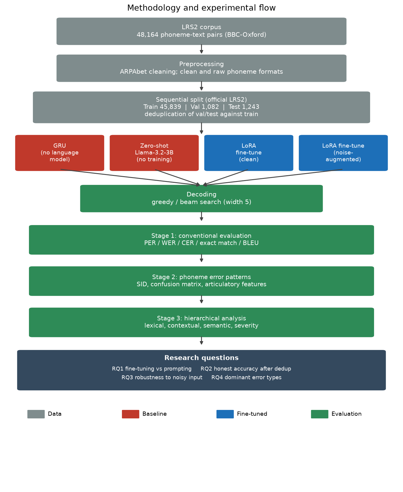

# Chapter 7. Methodology

This chapter sets out how the experiments were designed and run: the dataset and how the phoneme and text pairs were prepared, the corpus split and the contamination problem it revealed, and the design of the experiments and how each answers a research question. The models and techniques are described in Chapter 5 and the metrics in Chapter 6; this chapter is concerned with the experimental procedure that ties them together.

## 7.1 Dataset

All experiments use the Oxford-BBC Lip Reading Sentences 2 corpus (LRS2), a benchmark of natural sentences from British television (Chung et al., 2017), as sentence and phoneme pairs: each row is an English sentence with its phoneme transcription, and the version used contains 48,164 such pairs. The phonemes are given in the ARPAbet notation for English, which represents each sound as one or two letters, sometimes with a stress digit on a vowel.

The phoneme transcriptions are those distributed with the corpus rather than ones generated by an automatic grapheme-to-phoneme tool. This matters because an automatic tool leaves an unresolved marker on a noticeable fraction of sentences, mostly British spellings a standard American pronunciation dictionary does not cover, whereas the distributed transcriptions resolve every word, avoiding gaps that would confound the analysis of the model's own errors.

Two phoneme formats are prepared from each transcription. The clean format removes the sentence-boundary and word-boundary markers and the stress digits, leaving a plain sequence of phoneme symbols; the raw format keeps all of that markup. The clean format is the input to the fine-tuned models, being shorter and less redundant, while both formats are used for the zero-shot baseline so the effect of the markup on an untrained model can be measured. The text side is normalised to a consistent case so scoring compares words rather than capitalisation.

## 7.2 Data splits and the contamination problem

The corpus is divided using the official LRS2 sequential split, which matches the sizes reported in the literature and used by the prior work on this task: the first 45,839 rows form the training set, the next 1,082 the validation set, and the final 1,243 the held-out test set. The split is by position, so no row appears in more than one part by construction. The test set is not used during development at all, being reserved for the final evaluation so no design choice is tuned to it.

A problem becomes visible once the corpus is examined. Broadcast speech repeats stock phrases, so the corpus has 48,164 rows but fewer unique sentences, with some fillers appearing dozens of times. Because the split is by position, a sentence can appear in the training set and also, as a separate row, in the validation or test set, and a model that has memorised it scores a perfect result that does not reflect generalisation. On the validation set, 133 of the 1,082 sentences appear verbatim in training; on the test set, 152 of the 1,243 do.

This project addresses the problem by deduplication at evaluation time. The training data is left unchanged, since training on repeated sentences is legitimate. For evaluation, a set of every training sentence is built, and any evaluation sentence in that set is removed before scoring, leaving 949 clean validation sentences and 1,091 clean test sentences. Both figures are reported: the standard figure, on the full split, allows comparison with published results that use the raw split, and the deduplicated figure is the honest measure of generalisation. The corpus file is never modified; the filtering happens in memory at evaluation time.

## 7.3 Experimental design

The experiments are designed so that each research question is answered by a specific, controlled comparison. Figure 7.1 shows the whole flow, from the corpus through the four models and the decoding step to the three-stage evaluation and the research questions.

The first research question, whether fine-tuning beats prompting and how it compares with published encoder-decoder work, is answered by evaluating the same Llama-3.2-3B model in two conditions, prompted without training and fine-tuned with QLoRA, on the same data. The GRU baseline is a lower reference point with no pretrained language knowledge. All three are evaluated on the same held-out test set, so the comparison is like for like.

The second research question, how much accuracy is genuine once overlap is removed, is answered by the deduplication of the previous section: the fine-tuned model is scored on both the standard and deduplicated sets, and the difference measures the inflation caused by memorised sentences.

The third research question, robustness to imperfect input, has two elements. A second model is trained with noise augmentation, and both the clean-trained and noise-augmented models are evaluated under an inference-time corruption probe. The probe takes a fixed sample of evaluation sentences and corrupts their phoneme input at several rates with each of the three operations, scoring the two models on identical corrupted inputs. Because the corruption code is the same as in training, the training-time and test-time noise are consistent.

The fourth research question, the dominant error types and the role of homophones, is answered by the three-stage error analysis applied to both models' predictions, moving from conventional metrics through phoneme-level confusion patterns to a lexical, contextual, and semantic classification of the failing sentences.

Two variables are held fixed across comparisons to prevent confounds. The decoding strategy is recorded and matched whenever two models are compared, because it was found to change accuracy by several points. The evaluation set is matched, so a difference between models is not a difference between the sentences they were scored on. A fixed random seed is used for training so a run can be reproduced and a difference between runs reflects a real change.

## 7.4 Methodology flowchart

Figure 7.1 summarises the methodology described in this chapter: the corpus is preprocessed into phoneme and text pairs, split into training, validation, and test portions with deduplication applied to the evaluation portions, then passed through the four models and a recorded decoding step to the three-stage evaluation that answers the four research questions.

