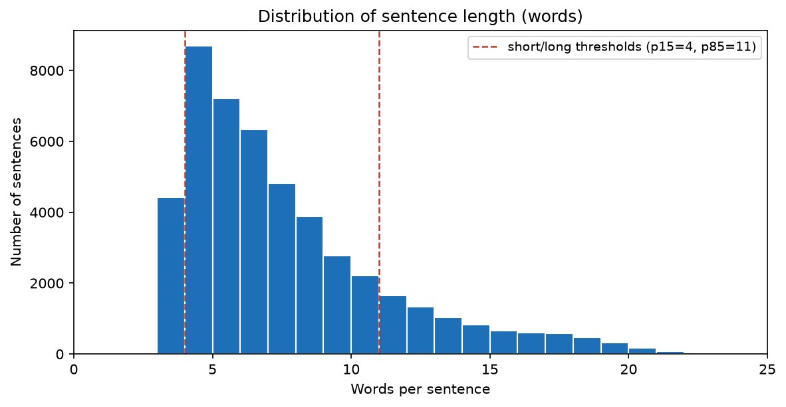
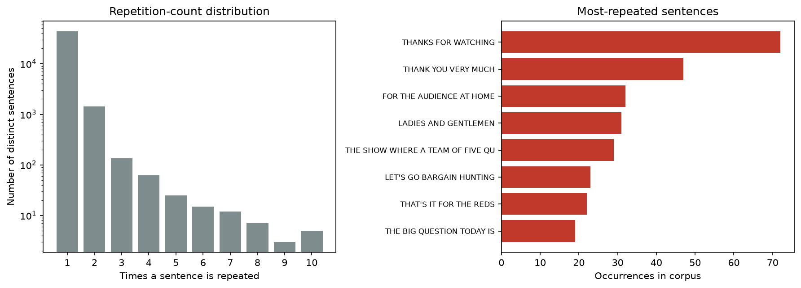

# Chapter 8. Exploratory Data Analysis

Before running the experiments, the LRS2 corpus was examined to understand its characteristics and surface any properties that would affect the design of the evaluation. This chapter reports that analysis: the size of the corpus and the length of its sentences, the proportion of sentences that contain homophone-prone words, and the extent of duplication. The last is the most consequential, because it motivated the deduplication procedure of Chapter 7.

## 8.1 Corpus characteristics and sentence length

The corpus contains 48,164 sentence and phoneme pairs. The sentences are short, as is typical of broadcast speech broken into utterances: 7.1 words on average, median 6, with the longest 24 words. The phoneme sequences are correspondingly short, averaging 25.5 per sentence with a median of 21 and a maximum of 85. Figure 8.1 shows the distribution of sentence length in words.

The distribution is concentrated at the short end with a long thin tail. The 15th and 85th percentiles fall at 4 and 11 words, and these are used later as the thresholds that define short and long sentences in the error analysis, so those categories are derived from the corpus itself rather than chosen arbitrarily. The short average length matters because a short sentence gives the decoder little context to resolve an ambiguous word, one reason the residual errors include wrong-word substitutions that a longer sentence might have made recoverable.

## 8.2 Homophone distribution

Each sentence was checked for a homophone-prone word, using a homophone word list derived from the pronunciation dictionary. Of the 48,164 sentences, 37,374 (77.6%) contain at least one such word and 10,790 (22.4%) contain none. Homophone-prone words are therefore common, as expected given that many high-frequency English words, such as "to", "two", "there", and "their", are homophones.

This distribution is why the evaluation is stratified by homophone membership, with metrics reported separately for sentences that contain a homophone-prone word and those that do not, so any difference in difficulty is visible. It is worth being precise about what the figure means. A sentence containing a homophone-prone word is not necessarily one the model gets wrong through a homophone confusion; the word may be transcribed correctly. The high proportion shows only that the opportunity for homophone confusion is widespread, a separate question from how often that confusion actually causes an error. Chapter 10 shows that it rarely does.

## 8.3 Duplication analysis

The most important property of the corpus for the evaluation is its duplication. Although it has 48,164 rows, it has only 45,455 unique sentences, so 2,709 rows (5.6%) repeat a sentence that appears elsewhere. Figure 8.2 shows the pattern. The left panel gives the distribution of repetition counts on a logarithmic scale: most sentences appear once, but a long tail appears many times. The right panel lists the most-repeated sentences, the stock phrases of broadcast television, led by "THANKS FOR WATCHING" at 72 occurrences, "THANK YOU VERY MUCH" at 47, and other fillers such as "LADIES AND GENTLEMEN" and "FOR THE AUDIENCE AT HOME".

This duplication has a direct consequence for evaluation. Because the corpus is split by position, a repeated sentence can fall into the training set and also, as a separate row, into the validation or test set, and a model that saw it during training then scores a perfect result on the copy, reflecting memorisation rather than generalisation. Measuring the overlap confirms the problem: 133 of the 1,082 validation sentences (12.3%) and 152 of the 1,243 test sentences (12.2%) appear verbatim in training. Roughly one evaluation sentence in eight is one the model may have memorised.

This finding motivated the deduplication procedure of Chapter 7, in which evaluation sentences that appear in the training set are removed before scoring. Without that step the headline accuracy would be inflated by the memorised sentences, and the inflation would be invisible in the reported number. The exploratory analysis therefore identifies a threat to the validity of the evaluation and directs the response to it.
