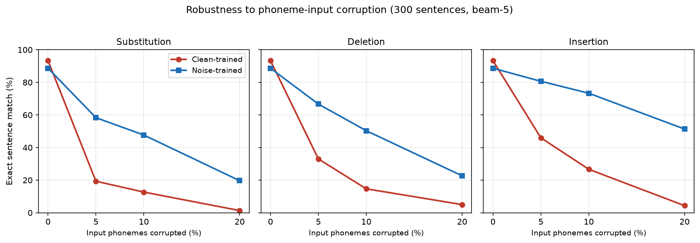
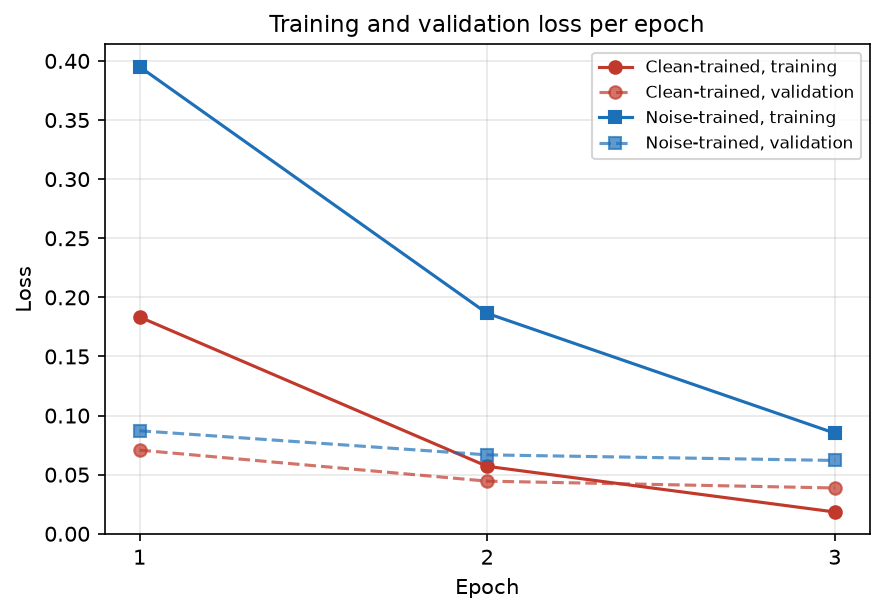

# Noise-augmented training: robustness to imperfect phoneme input

Project: homophone-aware phoneme-to-text decoding for lip-reading
Date: 23 July 2026
Model: Llama-3.2-3B with low-rank adapters, beam search width 5

## Summary

The decoder is trained on perfect phoneme transcriptions, but in a working
lip-reading system the phonemes come from a visual front-end that makes mistakes.
This report asks how the decoder holds up when its input is imperfect, and
whether deliberately training on imperfect input helps.

Two decoders were compared. The first was trained on clean phonemes. The second
was trained with half its input phonemes deliberately corrupted, a standard
robustness technique. Both were then tested on the same sentences at increasing
levels of input corruption.

The clean-trained decoder is fragile. Corrupting just one phoneme in twenty
drops its exact-match accuracy from 93% to between 19% and 46%, depending on the
type of corruption. The decoder trained on corrupted input is far more durable,
holding 58% to 81% under the same conditions. This robustness costs about 4
points of accuracy on perfect input, which is a favourable trade for any
deployment where the input will not be perfect.

## Why this matters

A phoneme-to-text decoder never sees perfect input in practice. The phonemes it
receives are the output of an earlier visual recognition stage, and that stage
mislabels sounds, misses them, or adds spurious ones. A decoder that performs
well only on flawless input would perform poorly in the complete system. The
question is therefore not only how accurate the decoder is, but how gracefully
it degrades when its input is disturbed.

## Method

Both decoders share the same base model, the same training data, the same three
training epochs, and the same beam-search decoding. They differ in one respect.
The clean model saw only correct phoneme sequences. The robust model had half of
its training sentences corrupted, each by one of three operations at a randomly
chosen level between 5% and 15%:

- substitution, standing in for a sound the front-end misheard
- deletion, for a sound the front-end missed
- insertion, for a sound the front-end added in error

Both models were then evaluated on 300 held-out sentences under a clean control
and under each of the three corruptions at 5%, 10% and 20%. Corruption was
applied only to the test input; the reference sentences were never altered.

## Result 1: the clean-trained decoder is fragile

On perfect input the clean-trained decoder reaches 93% exact match. A small
amount of input corruption removes most of that accuracy.

| Corruption at 5% | Clean-trained exact match |
|---|---|
| Substitution | 19.3% |
| Deletion | 33.0% |
| Insertion | 46.0% |

One corrupted phoneme in twenty is enough to more than halve the decoder's
accuracy, and in the substitution case to remove three quarters of it. This
tells us the clean-trained decoder depends heavily on receiving an exact phoneme
sequence, which is the condition a real front-end cannot guarantee.

## Result 2: training on corrupted input restores durability

The decoder trained on corrupted input degrades far more gently.

Reading the figure, both decoders begin together at zero corruption. As soon as
corruption appears, the clean-trained decoder drops steeply while the robust
decoder declines gradually. The gap between them is the benefit of training on
imperfect input, and it is large at every corruption level and every corruption
type.

| Condition | Clean-trained | Noise-trained | Gain |
|---|---|---|---|
| Substitution 5% | 19.3% | 58.3% | +39.0 |
| Substitution 10% | 12.7% | 47.7% | +35.0 |
| Substitution 20% | 1.3% | 19.7% | +18.4 |
| Deletion 5% | 33.0% | 66.7% | +33.7 |
| Deletion 10% | 14.7% | 50.3% | +35.6 |
| Deletion 20% | 5.0% | 22.7% | +17.7 |
| Insertion 5% | 46.0% | 80.7% | +34.7 |
| Insertion 10% | 26.7% | 73.3% | +46.6 |
| Insertion 20% | 4.3% | 51.3% | +47.0 |

Insertion is the mildest corruption for both decoders, because an added phoneme
leaves the real ones intact. Substitution is the harshest, because it replaces a
real sound with a misleading one. The robust decoder outperforms the fragile one
across all three.

## Result 3: the cost on clean input is small

Robustness is not free. On perfect input the robust decoder scores slightly
below the clean one.

| Evaluation | Clean-trained | Noise-trained | Cost |
|---|---|---|---|
| 300-sentence control | 93.3% | 88.7% | 4.7 |
| Full 949-sentence validation | 92.0% | 88.7% | 3.3 |

A drop of three to five points on perfect input buys a gain of 18 to 47 points
once the input is disturbed. For any setting where the phonemes arrive from an
imperfect source, which is every real deployment, the trade favours the robust
decoder.

## Training behaviour

The robust decoder settles at a higher training loss, which is expected: when
half the input sentences are corrupted, some no longer contain enough information
to recover the target perfectly, so the loss cannot fall as far. Validation loss
declined every epoch for both decoders with no upturn, so neither overfit and
both were still improving when training stopped.

## Conclusion and next steps

Training on imperfect phoneme input makes the decoder substantially more robust
to the kind of errors a visual front-end produces, at a small cost to accuracy
on perfect input. For the complete lip-reading system, where perfect input never
arrives, this is the more useful decoder.

Two directions follow. The corruption used here is uniform across all sounds,
whereas a real front-end confuses specific sounds that look alike on the lips;
matching the training corruption to those confusions should improve realism.
Final accuracy figures should also be confirmed on the held-out test set, which
has not yet been used.

## Notes on the numbers

Robustness figures are measured on 300 sentences with a fixed random seed, so the
two decoders are compared on identical inputs. The full-validation figures use
949 sentences. All evaluation uses beam-search decoding. Corruption is applied
only to the test input, and each corruption level is tested against a clean
control on the same sentences.
